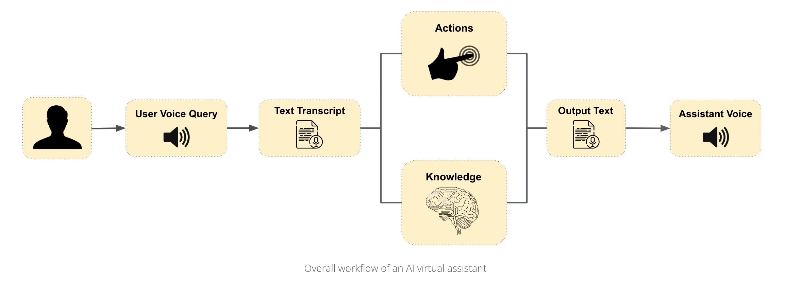
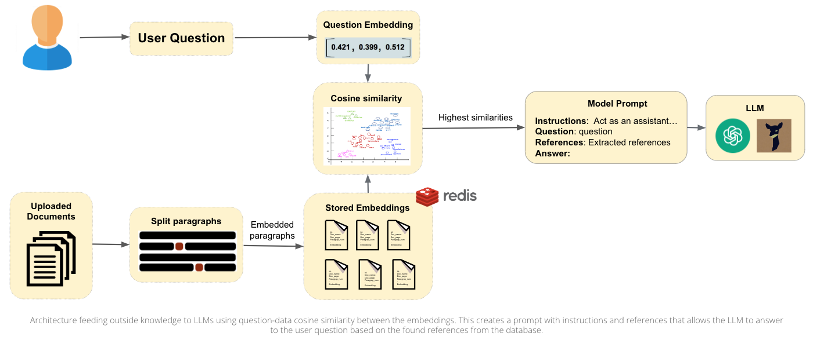

<!-- PROJECT SHIELDS -->

[![Contributors][contributors-shield]][contributors-url]
[![Forks][forks-shield]][forks-url]
[![Stargazers][stars-shield]][stars-url]
[![Issues][issues-shield]][issues-url]
[![MIT License][license-shield]][license-url]
[![LinkedIn][linkedin-shield]][linkedin-url]

#  AI - Virtual Assistant

<div style="text-align:center"><i>Imagine having a digital assistant that can chat with you like a real person, providing you with instant and relevant information whenever you need it. That's the power of an AI virtual assistant!</i></div>

<div style="text-align:center"></div>

<br>

## Built With...
<div style="text-align:center">

<br>


[![Python][Python]][Python-url]

<br>


</div>

# Introduction
In this workshop we introduce a virtual assistant chatbot that can be used to perform a variety of tasks. It can be used to open webpages, search for information, and even tell jokes. It also allows uploading your own personal documents and answering questions related to them.

<br>

# Table of Contents
[1. Virtual Assistant Workflow](#1-virtual-assistant-workflow)

&nbsp;&nbsp;&nbsp;&nbsp; [1.1 Speech to Text](#speech-to-text)
 
&nbsp;&nbsp;&nbsp;&nbsp; [1.2 Text to Intent](#text-to-intent)

&nbsp;&nbsp;&nbsp;&nbsp; [1.3 Action Execution](#action-execution)

&nbsp;&nbsp;&nbsp;&nbsp; [1.4 General Questions](#general-questions)

&nbsp;&nbsp;&nbsp;&nbsp; [1.5 Knowledge Database Retrieval](#knowledge-database-retrieval)

&nbsp;&nbsp;&nbsp;&nbsp; [1.6 Generate Response Text](#generate-response-text)

&nbsp;&nbsp;&nbsp;&nbsp; [1.7 Text to Speech](#text-to-speech)

[2. Streamlit Demo](#2-streamlit-demo)

[3. Instructions to Run the Virtual Assistant in your Laptop](#3-instructions-to-run-the-virtual-assistant-in-your-laptop)

&nbsp;&nbsp;&nbsp;&nbsp; [3.1 Installations](#installations)

&nbsp;&nbsp;&nbsp;&nbsp; [3.2 Clone the repository](#clone-the-repository)

&nbsp;&nbsp;&nbsp;&nbsp; [3.3 Steps to run the application](#steps-to-run-the-application)

[4. Connecting a Language Model](#connecting-a-language-model)

&nbsp;&nbsp;&nbsp;&nbsp; [4.1 Run Vicuna Locally](#runing-vicuna-locally)

&nbsp;&nbsp;&nbsp;&nbsp; [4.2 Connecting any other language model](#connecting-any-other-language-model)

[5. Presenters](#presenters)

<br>

# 1. Virtual Assistant Workflow


The `run_alexa` function is the main program loop. It takes no arguments and executes indefinitely until a `"terminate"` command is spoken. It listens for voice commands from the user and performs the associated action by calling the corresponding function based on the recognized command.

## Speech to Text
The first step in the workflow is to convert the user's speech into text. This is done using the SpeechRecognition library and is under the `take_command` function in `jarvis.py` to listen for voice input for a timeframe of 5 seconds (due to `timeout` and `phrase_time_limit`) and then return the spoken command as a string in lowercase format.
- We initialize a listener (imagine as if it is a digital microphone)
- Use `recognize_google()` function to send recorded voice to Google's speech recognition API that converts the audio into text

## Text to Intent
The next step is to convert the user's text into an intent, which is a command the chatbot can understand and execute. To accomplish this easily, we require the user to say `"Brain"` before asking information about the users data. The rest of the commands are handled as actions or general questions.

## Action Execution
Keywords are used to detect the type of action the user is requesting to be executed.
- blackboard
- notion
- mail
In the above example `webbrowser` module is used for opening up the commanded tabs. For example, the user might say `"open Blackboard"` and the chatbot should understand that the intent is to open the Blackboard webpage.

## General Questions
The assistant can respond to questions about up to date news and weather information. It can also tell jokes and respond to general questions such as `"What is Python?"` and `“What new discoveries from the James Webb Space Telescope can I tell my 9 year old about?”`. These general questions are handled by LLMs when there is no keyword detected.

When a keyword is detected, we make use of APIs to request information and receive a response from servers that have access to the requested data. The APIs we use are listed below.

### Weather API Endpoint
- Using geocoder library, user's geolocation is identified. 
- API key needs to be retrieved from the following website: https://api.openweathermap.org/  and put the way it is specified below.
```python
 https://api.openweathermap.org/data/2.5/weather?lat={g.latlng[0]}&lon={g.latlng[1]}&appid={API_KEY}
 ```
- With the API key the weather is retrieved.

### News about a specific topic API
https://newsapi.org/ 
- The command is split to get the keyword for the desired topic
- Sign up for an API_KEY through https://newsapi.org/ 
```python
 (https://newsapi.org/v2/top-headlines?q={search_query}&apiKey={API_KEY})
```
-  With the API key the news are retrieved.

### General news
This variable stores the URL for the Top News API endpoint, which returns the top headlines from the United Kingdom. It includes the API key as a parameter for authentication.
``` python
https://newsapi.org/v2/top-headlines?country=gb&apiKey={API_KEY}
```
- The headlines can be retrieved about any topic, you just need to change the query.

### Joke
The api that we chose for the Joke action receive a retrieves a data from an endpoint using a GET request. Then, it is converted into JSON format from where we access the Joke string.

### Plot of
Uses [omdb.com ](https://www.omdbapi.com/)
-API is used to retrieve plots of movies.
```python
https://www.omdbapi.com/?t={search_query}&plot=full&apiKey={API_KEY}
```

## Knowledge Database Retrieval
When the keyword `"Brain"` is detected in the users prompt, the chatbot understands that the user wants to ask a question about their personal data. The chatbot then retrieves the relevant information from the knowledge database and generates an appropriate response.

We use a Redis database, a NoSQL database that stores data in key-value pairs. See diagram below for an example of how these process is structured.




## Text to Speech
The final step in the workflow is to convert the chatbot's response text into speech. This is done using the Google Text-to-Speech API, which takes the chatbot's response text as input and outputs the corresponding speech. The speech is then played using the mixer library.

<br>


# 2. Streamlit Demo


# 3. Instructions to Run the Virtual Assistant in your Laptop

## Installations
### 1. Docker
1. Install [Docker](https://docs.docker.com/get-docker/) on your local machine. If you are using Mac make sure to choose the installation whcih fits your respective computer specs. (e.g. M1 Chip vs Intel i7)

### 2. Redis
1. Install [Redis GUI](https://redis.com/redis-enterprise/redis-insight/) on your local machine
2. Start the Redis server in the terminal using docker image with modules
```bash
docker run -d --name redis-stack-server -p 6379:6379 redis/redis-stack-server:latest
```
3. Add a Redis Database connection to the Redis server through the GUI. Click on "+ add database" and make sure that the database alias is set to the following: 

```
Database Alias: 127.0.0.1:6379
```


<br>

## Clone the repository
```bash
git clone https://github.com/IERoboticsClub/workshops
```
***Note:** If you don't have git installed, you can download the repository as a zip file by clicking on the green "Code" button on the top right of the repository page.*

## Steps to run the application

### Set up the Environment

 You can set up your environmentt with just one command in the terminal. Running one of the commands below, will basically run several commands at once to create a `venv` folder and install all the requirements.
<br>

> If you have any trouble during this step, refer to the [issues]() page, and check wether your issue has already been resolved, or open a new issue and we will try and fix it as soon as possible. 

For Apple: 
```bash
make env-mac-chatbot
```
For Windows: 
```bash
make env-win-chatbot
```
For Linux: 
```bash
make env-lin-chatbot
```

# Understanding the Makefile Commands

#### 1. Upgrade your `pip` (installer interface for python packages)

```bash
python -m pip install --upgrade pip
```

#### 2. Create & activate a virtual environment
```bash
python3 -m venv venv && source venv/bin/activate
```
#### 3. Install the dependencies
```bash
pip install -r ai-chatbot-assistant/requirements.txt
```
#### 4. Run the application
```bash
streamlit run ai-chatbot-assistant/Home.py
```

<br>

# Connecting a Language Model
In this section we offer 2 solutions to connect a language model to our chatbot. The first one is to use [Vicuna](https://vicuna.lmsys.org/), an Open-Source Chatbot Impressing GPT-4 with 90% ChatGPT Quality. The second one is to connect any other language model such as Bard, ChatGPT, etc.. by following the steps [here](#)

## Runing Vicuna Locally

- First of all, to run Vicuna, you need to have Vicuna. [Read the repo](https://github.com/IERoboticsClub/Vicuna)

- If you don't have Vicuna model, you could connect any other language model such as GPT-2, GPT-3, etc.. by following the steps [here](#)

- To run Vicuna we have a FastAPI Application which allows us to connect to our large language model.

- We used a macboook pro 64GB M1 chip to run both 7B and 13B Vicuna models, and it was running smoothly.

- To serve using the web UI, you need three main components: streamlit web UI, model worker that hosts Vicuna, and a controller to coordinate the UI with the model worker. Here are the commands to follow in your terminal:

Steps:
### 1. Launch the controller
```bash
python3 -m fastchat.serve.controller
```
- This yields an application startup on port 21001, to which you can start making requests.

### 2. Launch the model worker
```bash
python3 -m fastchat.serve.model_worker --model-path /path/to/vicuna/weights
```

> ```bash
> python3 -m fastchat.serve.model_worker --model-path vicuna_13B --device mps
> ```


At this point, you will have an endpoint open to access vicuna through payloads (message prompts) and get responses. 

### <u>Vicuna Troubleshooting</u>

PORTS ISSUES 
The ports you will be using are 7860, and 21001, 21002, 7860

If you get an error with any of the ports run the following scripts in your terminal: 

*Find the PID process of the PORT being used*
```sh 
sudo lsof -i :<port>
```
*kill PID* [CULTURE](https://www.youtube.com/watch?v=IuGjtlsKo4s)
```sh 
kill -9 <PID>
```
Example: 

```sh
 sudo lsof -i :21002
```

Output: 
```sh
COMMAND     PID           USER   FD   TYPE             DEVICE SIZE/OFF NODE 
Google      673 ieroboticsclub   31u  IPv6 0x7fe8b004caaac511      0t0  TCP 
Python     3506 ieroboticsclub   14u  IPv6 0x7fe8b004caacaa91      0t0  TCP 
````
Kill:
```sh
kill -9 673 3506
```
Any other issues,  please refer to the [Vicuna Documentation](https://github.com/lm-sys/FastChat)

## Connect any other language model

The connection to the GPT models family can be made through the streamlit app. Bard integration if future work so feel free to make a [PR](https://github.com/IERoboticsClub/workshops/pulls) on it and contribute :)

<br>

# Contribute

Contributions are what make the open source community such an amazing place to learn, inspire, and create. Any contributions you make are **greatly appreciated**.


If you have a suggestion that would make this better, please fork the repo and create a pull request. You can also simply open an issue with the tag "enhancement".

Don't forget to give the project a star! Thanks again!

1. Fork the Project and create a feature: 
2. Create your Feature Branch (`git checkout -b feature/AmazingFeature`)
3. Commit your Changes (`git commit -m 'Add some AmazingFeature'`)
4. Push to the Branch (`git push origin feature/AmazingFeature`)
5. Open a Pull Request

Feel Free to contact us: 

[](mailto:robotics.club@ie.edu)


<p align="right">(<a href="#CMC">back to top</a>)</p>

# Presenters
- Nicholas Dieke
- [Adnan Bhanji](https://github.com/adnanbhanji)
- [Vera Prohaska](https://github.com/vtwoptwo)
- [Diego Sanmartin](https://github.com/dsanmart)
- [Keti Sulamanidze](https://github.com/)


<br>

Event organized by:
<br>
<div style="text-align:center"></div>
<div style="text-align:center"></div>
<br>


<!-- MARKDOWN LINKS & IMAGES [![Name][Shield]][url] -->
<!-- https://www.markdownguide.org/basic-syntax/#reference-style-links -->
[contributors-shield]: https://img.shields.io/github/contributors/IERoboticsClub/workshops.svg?style=for-the-badge
[contributors-url]: https://github.com/IERoboticsClub/workshops/graphs/contributors 
[forks-shield]: https://img.shields.io/github/forks/IERoboticsClub/workshops.svg?style=for-the-badge
[forks-url]: https://github.com/IERoboticsClub/workshops/network/members
[stars-shield]: https://img.shields.io/github/stars/IERoboticsClub/workshops.svg?style=for-the-badge
[stars-url]: https://github.com/IERoboticsClub/workshops/stargazers
[issues-shield]: https://img.shields.io/github/issues/IERoboticsClub/workshops.svg?style=for-the-badge
[issues-url]: https://github.com/IERoboticsClub/workshops/issues
[license-shield]: https://img.shields.io/github/license/IERoboticsClub/workshops.svg?style=for-the-badge
[license-url]: https://github.com/IERoboticsClub/workshops/blob/master/LICENSE.txt
[linkedin-shield]: https://img.shields.io/badge/-LinkedIn-black.svg?style=for-the-badge&logo=linkedin&colorB=555
[linkedin-url]: https://www.linkedin.com/in/vera-prohaska-31734b1b5/
[Next.js]: https://img.shields.io/badge/next.js-000000?style=for-the-badge&logo=nextdotjs&logoColor=white
[Next-url]: https://nextjs.org/
[React.js]: https://img.shields.io/badge/React-20232A?style=for-the-badge&logo=react&logoColor=61DAFB
[React-url]: https://reactjs.org/
[Vue.js]: https://img.shields.io/badge/Vue.js-35495E?style=for-the-badge&logo=vuedotjs&logoColor=4FC08D
[Vue-url]: https://vuejs.org/
[Angular.io]: https://img.shields.io/badge/Angular-DD0031?style=for-the-badge&logo=angular&logoColor=white
[Angular-url]: https://angular.io/
[Svelte.dev]: https://img.shields.io/badge/Svelte-4A4A55?style=for-the-badge&logo=svelte&logoColor=FF3E00
[Svelte-url]: https://svelte.dev/
[Laravel.com]: https://img.shields.io/badge/Laravel-FF2D20?style=for-the-badge&logo=laravel&logoColor=white
[Laravel-url]: https://laravel.com
[Bootstrap.com]: https://img.shields.io/badge/Bootstrap-563D7C?style=for-the-badge&logo=bootstrap&logoColor=white
[Bootstrap-url]: https://getbootstrap.com
[JQuery.com]: https://img.shields.io/badge/jQuery-0769AD?style=for-the-badge&logo=jquery&logoColor=white
[JQuery-url]: https://jquery.com 
[CPP-url]: https://cplusplus.com/
[C++]: https://img.shields.io/badge/C++-blue
[Python]: https://img.shields.io/badge/python-3670A0?style=for-the-badge&logo=python&logoColor=ffdd54
[Python-url]: https://www.python.org/
[Jupyter]: https://img.shields.io/badge/jupyter-%23FA0F00.svg?style=for-the-badge&logo=jupyter&logoColor=white
[Jupyter-url]: https://jupyter.org/
[SciKit-Learn]: https://img.shields.io/badge/scikit--learn-%23F7931E.svg?style=for-the-badge&logo=scikit-learn&logoColor=white
[SciKit-Learn-url]: https://scikit-learn.org/stable/
[Scipy]: https://img.shields.io/badge/scikit--learn-%23F7931E.svg?style=for-the-badge&logo=scikit-learn&logoColor=white
[Scipy-url]:https://scipy.org/
[Tensorflow]: https://img.shields.io/badge/TensorFlow-%23FF6F00.svg?style=for-the-badge&logo=TensorFlow&logoColor=white
[Tensorflow-url]:https://www.tensorflow.org/
[Pandas]: https://img.shields.io/badge/pandas-%23150458.svg?style=for-the-badge&logo=pandas&logoColor=white
[Pandas-url]: https://pandas.pydata.org/