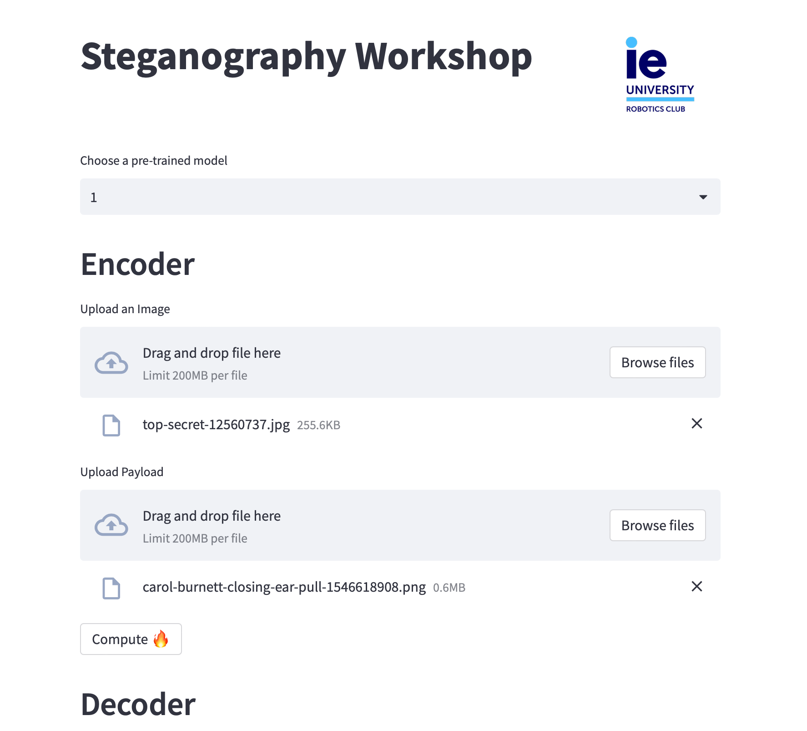
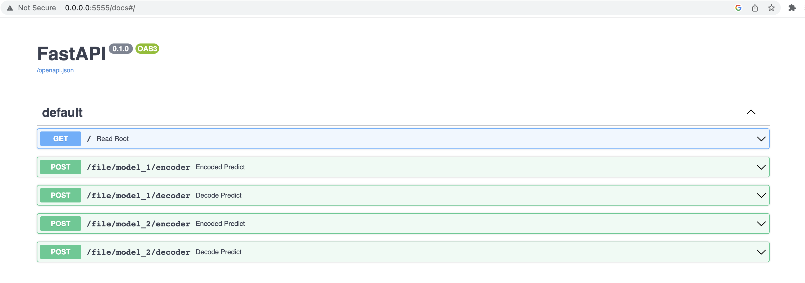

# IEU Robotics Steganography Workshop 


<div style="text-align:center"></div>

<br>

## What is steganography? 🔐

Steganography is the practice of concealing a file, message, image, or video within another file, message, image, or video. The word steganography combines the Greek words steganos (στεγανός), meaning "covered or protected", and graphein (γράφειν), meaning "writing". The purpose of steganography is to avoid detection; the essence of steganography is to hide the existence of a communication, not its content.

<br>

> _**With great power comes much responsibility**_: In the year 499 B.C.E., Histiaeus — a Greek adviser to the Persian King Darius I — ordered an enslaved person to visit his son-in-law, Aristagoras. When the man arrived, he asked that his head be shaved. 
> There, tattooed on the enslaved person's scalp, was a hidden message from Histiaeus. It told Aristagoras to instigate an uprising against none other than the Persian King himself, Darius I.

<br>


## Origings of Steganography in AI 📝 

Interetested in reading the paper? Check it out ➡️ <br>
[END-TO-END TRAINED CNN ENCODER-DECODER NETWORKS FOR IMAGE
STEGANOGRAPHY](https://arxiv.org/pdf/1711.07201.pdf)

Using a neural network, the image can be modified in a more subtle way that is less likely to be detected by humans. The neural network can be trained on a large dataset of images and corresponding hidden messages to learn how to encode and decode messages effectively. The network can then use this knowledge to encode a new message within an image in a way that is both imperceptible and difficult to detect.

In this way, a neural network can provide a more robust and effective solution for image steganography compared to traditional methods.

[Traditional methods](https://en.wikipedia.org/wiki/Steganography) of image steganography involve modifying the least significant bits of the image pixels to encode the message. However, this can result in visual artifacts and is relatively easy to detect.


Neural networks have shown to be more effective in encoding and decoding steganography messages compared to classic methods for several reasons:

**Higher accuracy:** Neural networks can achieve higher accuracy rates in detecting and decoding steganography messages compared to classic methods. This is because neural networks can learn complex patterns and relationships in the data, which is difficult to achieve using traditional methods.

**Robustness:** Neural networks can handle noisy and distorted data, which is common in steganography messages. Traditional methods may struggle to decode a message if there is even a slight distortion or noise, whereas neural networks can still decode the message accurately.

**Adaptability:** Neural networks can adapt to different types of steganography methods and can learn to decode messages without needing prior knowledge of the specific steganography technique used. This makes them more versatile and effective compared to traditional methods that require specific knowledge of the encoding and decoding process for each steganography technique.

**Speed:** Neural networks can perform encoding and decoding tasks quickly and efficiently compared to traditional methods, which may take longer to complete.

Overall, neural networks are a more powerful tool for encoding and decoding steganography messages due to their ability to learn complex patterns and relationships in the data, handle noisy and distorted data, adapt to different steganography methods, and perform tasks quickly and efficiently.


## About the Workshop

This workshop will go over: 

- What is steganography?
- Model Architecture
- Practical implementation
- Demo


### Want to train the model yourself? 

[DATA](enlace)

# Run the demos

There are 2 different demos available for this workshop. They both have very similar functionality, but they are implemented using different technologies.


## Streamlit Demo



Instructions to run it:
1. Access the ```demos``` directory
```shell
cd demos
```
2. Create & activate a virtual environment
```shell
python3 -m venv venv && source venv/bin/activate
```
3. Install the dependencies
```shell
pip install -r requirements.txt
```
4. Run the streamlit app
```shell
streamlit run app.py
```


## FastAPI Demo

1. Build the Docker image
```shell
docker build -t stegano-demo .
```
2. Run the docker image
```shell
docker run -i -t -p 5555:5555 stegano-demo
```
3. Open up the demo in your browser (preferably chrome) through http://0.0.0.0:5555/docs#/


# Presenters
- [Vera Prohaska](https://github.com/vtwoptwo)
- [Diego Sanmartin](https://github.com/dsanmart)